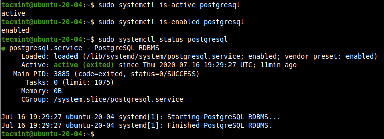
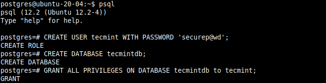

# How to Install PostgreSQL and pgAdmin4 in Ubuntu 20.04

Log into your Ubuntu system and update the system software packages using the following apt command.
```$
sudo apt update
```

Now install the latest version of PostgreSQL from the default Ubuntu repositories.
```$
sudo apt install postgresql
```
During the installation, the installer will create a new PostgreSQL cluster (a collection of databases that will be managed by a single server instance), thus initialize the database. The default data directory is /var/lib/postgresql/12/main and the configurations files are stored in the /etc/postgresql/12/main directory.


After PostgreSQL installed, you can confirm that the PostgreSQL service is active, running and is enabled under systemd using the following systemctl commands:
```$
sudo systemctl is-active postgresql
sudo systemctl is-enabled postgresql
sudo systemctl status postgresql
```



Also, confirm that the Postgresql server is ready to accept connections from clients as follows:
```$
sudo pg_isready
```


## Creating Database in PostgreSQL
To create a new database in PostgreSQL, you need to access the PostgreSQL database shell (psql) program. First, switch to the postgres system user account and run the psql command as follows:
```$
sudo su - postgres
psql
postgres=# 
```

Now create a new database and a user using the following commands.
```$
postgres=# CREATE USER tecmint WITH PASSWORD 'securep@wd';
postgres=# CREATE DATABASE tecmintdb;
postgres=# GRANT ALL PRIVILEGES ON DATABASE tecmintdb to tecmint;
postgres=# \q
```
